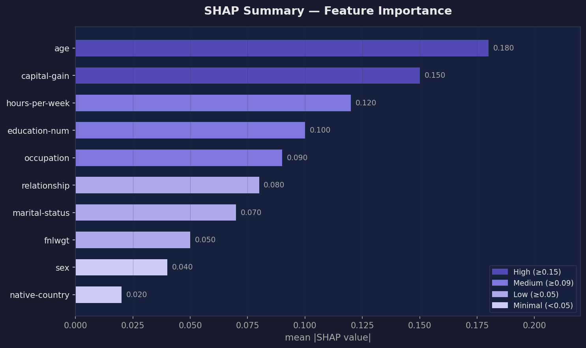
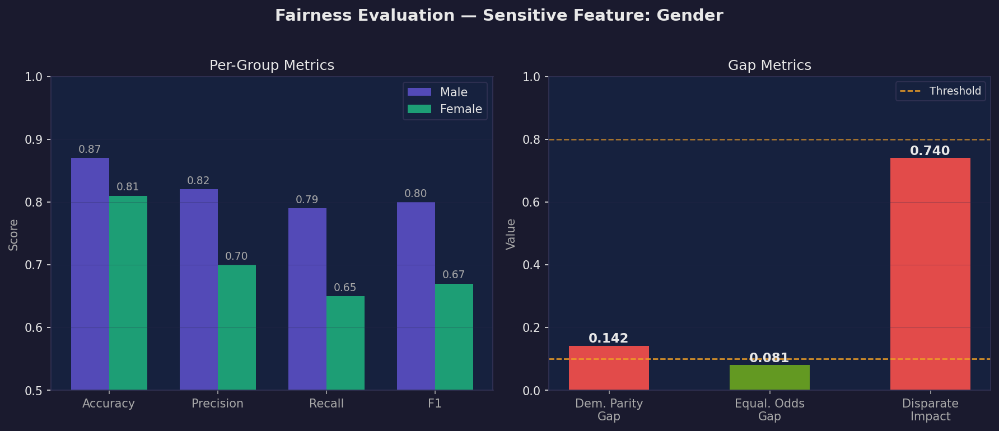
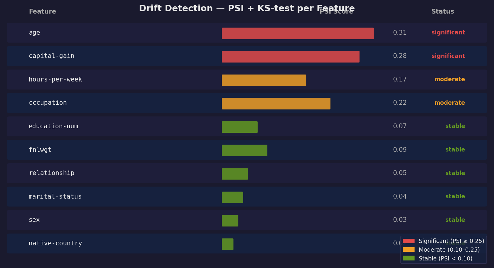
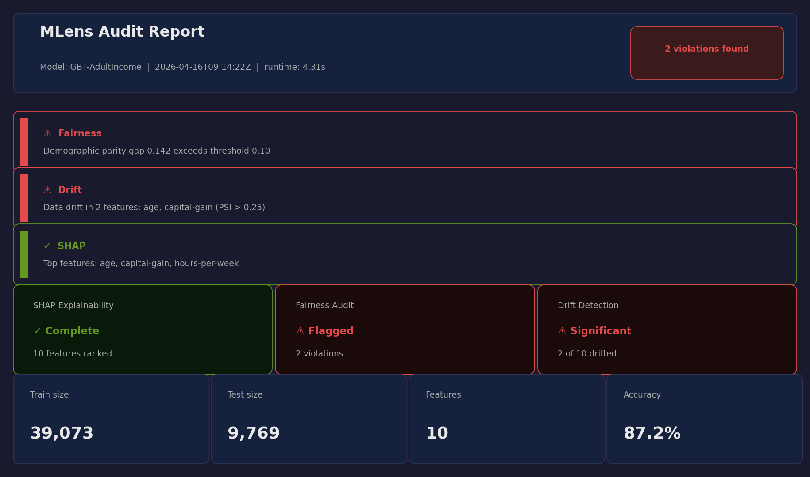

# 🔬 MLens — Explainable ML Audit Tool

<p align="center">
  
  <video src="docsassetsdemo.mp4" controls width="100%"></video>
</p>

<p align="center">
  <a href="https://github.com/yourusername/mlens/actions"></a>
  <a href="https://pypi.org/project/mlens/"></a>
  <a href="https://opensource.org/licenses/MIT"></a>
  <a href="https://python.org"></a>
  
</p>

> **Drop in any trained ML model. Get a full audit report — explainability, fairness, drift — in seconds.**

Most ML portfolios show model accuracy. **MLens** shows everything that matters *after* deployment: *why* a model decides what it decides, *who* it harms, and *when* it starts to degrade.

This is the tool you need for enterprise AI governance, regulatory compliance (GDPR, EU AI Act), and ML interviews that go beyond "what's your accuracy?"

---

## ✨ Features

| Module | What it does |
|---|---|
| **🧠 SHAP Explainability** | Auto-selects TreeExplainer / LinearExplainer / KernelExplainer. Global importance bar charts + local waterfall plots per prediction. |
| **⚖️ Fairness Evaluation** | Demographic Parity Gap, Equalized Odds Gap, Disparate Impact (EEOC 4/5ths rule), and full per-group breakdown across any protected attribute. |
| **📊 Drift Detection** | PSI (Population Stability Index) + KS-test per feature. Flags stable / moderate / significant shifts between training and production data. |
| **📄 HTML Report** | One-page interactive audit report with Plotly charts, plain-English summary, and per-feature drill-down. |

---

## ⚙️ How It Works

```
Your trained model
      │
      ▼
┌─────────────────────────────────────────────┐
│              ModelAuditor.run()             │
│                                             │
│  ① ShapAnalyzer   →  ShapResult            │
│     TreeExplainer / Linear / Kernel        │
│                                             │
│  ② FairnessEvaluator  →  FairnessResult    │
│     fairlearn MetricFrame + flagging       │
│                                             │
│  ③ DriftDetector  →  DriftResult           │
│     PSI (equal-freq bins) + KS-test        │
│                                             │
│  ④ ReportGenerator  →  mlens_report.html   │
└─────────────────────────────────────────────┘
```

1. **SHAP** — MLens picks the fastest explainer for your model family. Tree-based models use TreeExplainer (near-instant); black-box models fall back to KernelExplainer with k-means summarisation.
2. **Fairness** — You pass a single sensitive feature (e.g. `df["gender"]`). MLens computes gap metrics and flags anything that exceeds configurable thresholds.
3. **Drift** — Your training data is the reference. PSI bins are built on reference quantiles, then applied to production data. KS-test provides a second opinion.
4. **Report** — All results are assembled into a single interactive HTML file (no server required, fully offline).

---

## 🛠️ Tech Stack

| Layer | Libraries |
|---|---|
| **Explainability** | `shap >= 0.44` |
| **Fairness** | `fairlearn >= 0.10`, `scikit-learn` |
| **Drift** | `scipy` (KS-test), custom PSI implementation |
| **Visualisation** | `plotly >= 5.18` |
| **Report** | `jinja2`, embedded Plotly HTML |
| **Model Support** | sklearn, XGBoost, LightGBM, (PyTorch via KernelExplainer) |

---

## 🚀 Installation

```bash
pip install mlens
```

Or from source:

```bash
git clone https://github.com/yourusername/mlens.git
cd mlens
pip install -e ".[dev]"
```

---

## 🏃 Quick Start

```python
from mlens import ModelAuditor

# Any trained sklearn / XGBoost / LightGBM model
auditor = ModelAuditor(
    model=trained_model,
    X_train=X_train,
    X_test=X_test,
    y_test=y_test,
    sensitive_features=df_test["gender"],   # protected attribute
    feature_names=list(X.columns),
    model_name="MyProductionModel",
)

report = auditor.run()
report.save("audit_report.html")   # → opens in any browser
```

Run the full demo:

```bash
python examples/quickstart.py
```

---

## 🖼️ Visuals

<p align="center">
  
  &nbsp;
  
</p>

<p align="center">
  
  &nbsp;
  
</p>

---

## 📁 Project structure 

```
mlens/
├── mlens/
│   ├── auditor.py                  ← Main orchestrator (start here)
│   ├── explainability/
│   │   └── shap_analyzer.py        ← SHAP auto-selector
│   ├── fairness/
│   │   └── fairness_metrics.py     ← fairlearn wrapper + flagging
│   ├── drift/
│   │   └── drift_detector.py       ← PSI + KS-test per feature
│   └── report/
│       ├── html_generator.py       ← Jinja2 + Plotly report builder
│       └── templates/
│           └── report.html.j2
├── examples/
│   └── quickstart.py               ← Adult Income end-to-end demo
├── tests/
│   ├── test_auditor.py
│   ├── test_fairness.py
│   └── test_drift.py
├── requirements.txt
└── README.md
```
## 📁 Project Structure
```
mlens/
│
├── mlens/                            ← Core package
│   ├── __init__.py                   ✅ v0.1.0
│   ├── auditor.py                    ✅ v0.1.0
│   ├── explainability/
│   │   └── shap_analyzer.py          ✅ v0.1.0
│   ├── fairness/
│   │   └── fairness_metrics.py       ✅ v0.1.0
│   ├── drift/
│   │   └── drift_detector.py         ✅ v0.1.0
│   ├── report/
│   │   ├── __init__.py               🆕 v0.2.0
│   │   ├── html_generator.py         🆕 v0.2.0
│   │   ├── pdf_generator.py          🆕 v0.2.0
│   │   └── templates/
│   │       └── report.html.j2        🆕 v0.2.0
│   └── cli/
│       ├── __init__.py               🆕 v0.2.0
│       └── main.py                   🆕 v0.2.0
│
├── dashboard/
│   └── app.py                        🆕 v0.2.0 (Streamlit)
│
├── examples/
│   └── quickstart.py                 ✅ v0.1.0
│
├── tests/
│   ├── test_auditor.py               🆕 v0.2.0
│   ├── test_fairness.py              🆕 v0.2.0
│   └── test_drift.py                 🆕 v0.2.0
│
├── docs/
│   └── assets/                       ✅ v0.1.0 (4 charts + banner)
│
├── README.md                         ✅ v0.1.0
├── CONTRIBUTING.md                   ✅ v0.1.0
├── setup.py                          🆕 v0.2.0
├── requirements.txt                  🆕 v0.2.0 (updated)
└── .github/workflows/ci.yml          ✅ v0.1.0
mlens/
├── api/                          🆕 v0.3.0
│   ├── main.py                   ← FastAPI app
│   ├── routes/
│   │   ├── audit.py              ← POST /audit endpoint
│   │   └── health.py             ← GET /health endpoint
│   └── schemas/
│       └── request.py            ← Pydantic models
├── docker/                       🆕 v0.3.0
│   ├── Dockerfile
│   └── docker-compose.yml
├── .github/workflows/
│   ├── ci.yml                    ✅ existing
│   └── docker-publish.yml        🆕 v0.3.0
└── README.md                     ← update with API docs
```
```
mlens/
├── explainability/
│   ├── shap_analyzer.py        ✅ existing
│   └── pytorch_explainer.py    🆕 v0.4.0 ← Native PyTorch SHAP
├── drift/
│   ├── drift_detector.py       ✅ existing  
│   └── concept_drift.py        🆕 v0.4.0 ← ADWIN + Page-Hinkley
├── integrations/               🆕 v0.4.0
│   ├── mlflow_tracker.py       ← Log audits to MLflow
│   └── wandb_tracker.py        ← Log audits to W&B
├── notebooks/                  🆕 v0.4.0
│   └── mlens_tutorial.ipynb    ← Full Jupyter tutorial
└── tests/
    ├── test_pytorch.py         🆕 v0.4.0
    └── test_concept_drift.py   🆕 v0.4.0
```
```
mlens/
├── docs/
│   ├── index.html              🆕 GitHub Pages landing site (dark, custom design)
│   ├── getting-started.md      🆕 5-minute quickstart
│   ├── cli-reference.md        🆕 Every CLI flag documented
│   ├── api-reference.md        🆕 Full Python API docs
│   ├── fairness-guide.md       🆕 Explains DP gap, EO gap, disparate impact
│   ├── changelog.md            🆕 v0.1.0 → v0.4.0 history
│   └── _config.yml             🆕 GitHub Pages config
└── notebooks/
    └── mlens_tutorial.ipynb    🆕 Full interactive walkthrough
```
```
mlens/
├── comparison/                   🆕 Compare N models side-by-side
│   ├── __init__.py
│   ├── model_comparator.py       ← runs audit on each model, ranks them
│   └── comparison_report.py      ← interactive side-by-side HTML report
├── batch/                        🆕 Audit 100s of models in parallel
│   ├── __init__.py
│   ├── batch_auditor.py          ← ThreadPoolExecutor parallel auditing
│   └── batch_report.py           ← master summary HTML + CSV
├── monitoring/                   🆕 Alerts when drift/fairness fires
│   ├── __init__.py
│   └── alert_manager.py          ← Slack webhook + SMTP email alerts
└── tests/
    ├── test_comparator.py         🆕 12 tests
    └── test_batch.py              🆕 11 tests

---

## 🧪 Running Tests

```bash
pytest tests/ -v --cov=mlens --cov-report=term-missing
```
---

## 🗺️ Roadmap

- [ ] PyTorch model support (native, no KernelExplainer fallback)
- [ ] PDF report export
- [ ] Intersectional fairness (multi-attribute)
- [ ] Concept drift detection (ADWIN, Page-Hinkley)
- [ ] CLI: `mlens audit model.pkl X_test.csv`
- [ ] Streamlit dashboard UI

---

## 🤝 Contributing

Pull requests are welcome! See [CONTRIBUTING.md](CONTRIBUTING.md) for guidelines.

---

## 📜 License

MIT © 2026 [Sai Ganesh](https://github.com/saiganesh47)

---

## 📚 References

- Lundberg & Lee, *A Unified Approach to Interpreting Model Predictions* (NeurIPS 2017)
- Bird et al., *Fairlearn: A toolkit for assessing and improving fairness in AI* (2020)
- Hardt et al., *Equality of Opportunity in Supervised Learning* (NeurIPS 2016)
- EEOC Uniform Guidelines on Employee Selection Procedures (1978)
